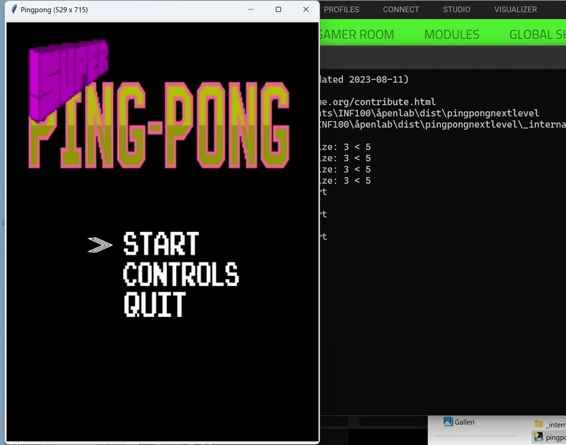
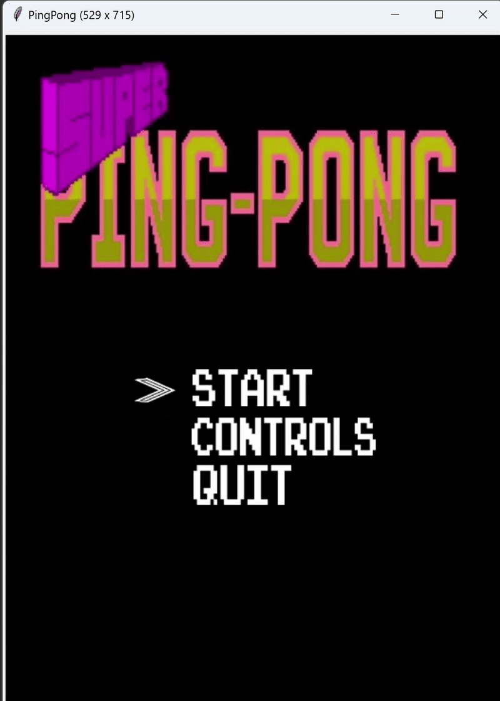
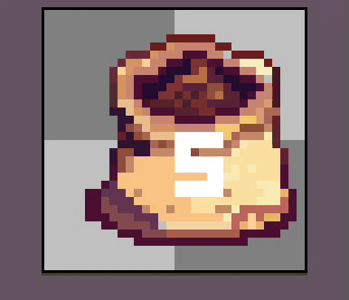
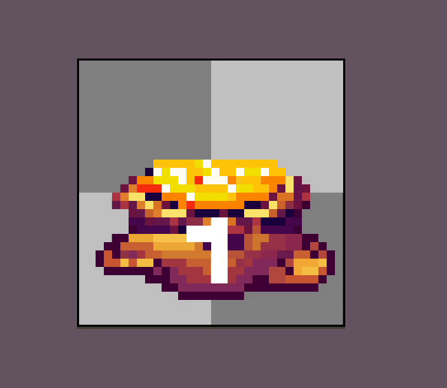

# About me
- Currently enrolled onto a BS in computer science
- Doing Java projects day by day, currently working on extracting user information such as name and IBAN using the EU PSD2 API.
- Would be happy to collaborate on making a multiplayer game from scratch as well as designing a game engine from scratch.
- Very interested in becoming more proficient in C++ and mechatronics. 
- Hobbies and interests include history, anthropology, CNC, 3D animation and design, electronics, drones, gymming and reading :) 
- I can be reached at gustenbrandt@gmail.com

- Sword I made in Blender

- Ping Pong project

- Farming simulator and game assets
  
  
  
  
  
